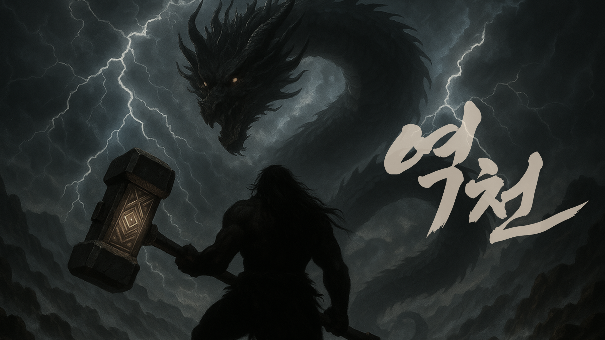

# 역천: _The Sky Breaker_

## 수정 예정

> 백 년 전, 환웅과 웅녀의 혼인을 부정하며  
> 지상의 질서를 뒤흔들었던 천위단의 반란  
>  
> 그들은 진압되었으나, 소멸하지 않았다  
>  
> 단군 5대의 시대  
> 천위단의 잿빛 그림자가 다시금 세상을 뒤덮는다  
>  
> 환웅과 웅녀의 피를 잇는 진헌  
> 마을을 구하기 위해 수호룡을 찾아 나선 그가 마주한 것은  
> 수호자가 아닌, 천위단에 의해 광기에 물든 용이었다  
>  
> 오염된 하늘의 의지,  
> 그리고 미쳐버린 수호신 앞에서  
>  
> 곰의 후예는 선택해야 한다  
> 무릎 꿇을 것인가, 맞설 것인가  
>  
> 하늘을 거스르는 자의 전설이 지금 시작된다  

 

## 🎥 게임 플레이 시연 | Gameplay Demo

| 튜토리얼 |
|:------:|
|  |
| 플레이어 스킬 소개 |
|  |
| 일반 몬스터 처치 |

 

| 스테이지 1 - _백호_ |
|:------:|
|  |
| 돌진 & 공격 |
|  |
| 분신 소환 |

 

| 스테이지 2 - _청룡_ |
|:------:|
|  |
| 화염구 & 돌진 |
|  |
| 번개 소환 |

 

## 🕹️ 조작 방법 | Controls

| 기능 | 키 |
|:------:|:-----:|
| 이동 | W / A / S / D |
| 점프 | 스페이스바 |
| 회피 | Shift |
| 조준 | Ctrl |
| 근접 공격 | 마우스 좌클릭 |
| 원거리 공격 | 마우스 우클릭 |

 

## 🎮 포트리스 멤버 | FORTRESS Members

| Profile | Name | Major | Role | Development | GitHub |
|:--------:|:--------:|:--------:|:--------:|:--------:|:--------:|
|  | 조현우 | 휴먼AI공학전공 게임전공 | 팀장 | 보스 몬스터 **청룡** | [@nvunwoo](https://github.com/nvunwoo) |
|  | 조준환 | 게임전공 | 기획 & 스토리 | 주인공 **진헌** | [@JoJunHwan](https://github.com/JoJunHwan) |
|  | 강민우 | 휴먼AI공학전공 게임전공 | 게임 컨셉 디자인 | 보스 몬스터 **백호** | [@DrugK](https://github.com/DrugK) |
|  | 최윤서 | 한일문화콘텐츠전공 게임전공 | 레벨 디자인 | 스테이지 & 몬스터 | [@YunseoC](https://github.com/YunseoC) |
|  | 이예랑 | 컴퓨터과학전공 | 사운드 디자인 | 몬스터 | [@???](https://github.com) |

 

## 🛠️ 개발 환경 | Tech Stack

| 구성 요소 | 기술 |
|:------:|:------:|
| Game Engine |  |
| Language | 	 |
| Version Control |  |
| Documentation |  |
| Communication |  |

 

 

 

 

 
